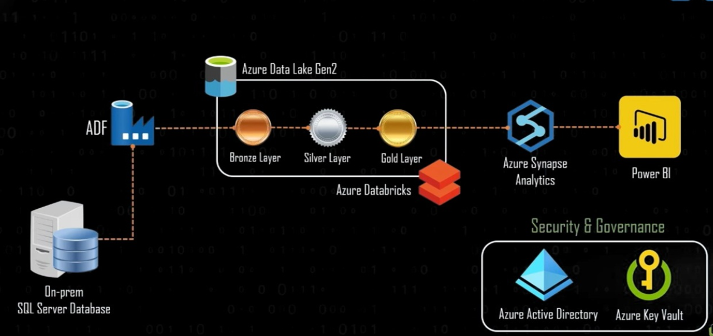

# Azure-Data-Pipeline-for-Retail-Analytics

## **Project Overview**
This project demonstrates the creation of a robust data pipeline using various Azure services to manage, process, and analyze retail data effectively. Below is a detailed explanation of the project, its components, the dataset used, and the steps taken to complete it.

## **Architecture Components**

On-premises SQL Server Database: Acts as the source of the raw data.

Azure Data Factory (ADF): Responsible for orchestrating the data movement from the on-premises SQL Server to Azure Data Lake Gen2.

Azure Data Lake Gen2: Serves as the storage solution for the data in different stages:

Bronze Layer: Raw data

Silver Layer: Cleaned and transformed data

Gold Layer: Aggregated and enriched data

Azure Databricks: Used for data processing and transformations, facilitating the transition from Bronze to Silver to Gold layers.

Azure Synapse Analytics: Enables advanced analytics and data warehousing solutions.

Power BI: Utilized for data visualization and reporting, providing business insights.

Security & Governance: Ensured using Azure Active Directory and Azure Key Vault for authentication, authorization, and secrets management.

## **Dataset**

Retail Sales Dataset:
Source: The dataset is sourced from an on-premises SQL Server database containing retail sales data.

Content: It includes detailed information on sales transactions, product details, customer demographics, and store information.

Volume: The dataset comprises millions of records, providing a comprehensive view of retail operations.

Purpose: This dataset is used to perform data analytics to uncover trends, customer behavior, and sales performance, enabling data-driven decision-making.

## **Steps to Initialize and Complete the Project**

### 1. Setup and Configuration:
Provision Azure Services: Set up Azure Data Factory, Azure Data Lake Gen2, Azure Databricks, Azure Synapse Analytics, and Power BI.

Establish Security: Configure Azure Active Directory for user authentication and Azure Key Vault for secure management of keys and secrets.

### 2. Data Ingestion:
Data Movement with ADF: Use Azure Data Factory to create pipelines that extract data from the on-premises SQL Server and load it into the Bronze layer of Azure Data Lake Gen2.

### 3. Data Processing and Transformation:
Bronze to Silver Transformation: Use Azure Databricks to clean and transform the raw data stored in the Bronze layer, and store the processed data in the Silver layer.

Silver to Gold Transformation: Further process and aggregate the data in Azure Databricks, then store the enriched data in the Gold layer.

### 4. Data Analytics and Reporting:
Data Warehousing: Load the data from the Gold layer into Azure Synapse Analytics for advanced analytics and querying.

Data Visualization: Connect Power BI to Azure Synapse Analytics to create interactive dashboards and reports, providing actionable insights.

### 5. Security and Governance:
Access Management: Ensure that data access is securely managed through Azure Active Directory.

Secret Management: Use Azure Key Vault to manage sensitive information such as connection strings and API keys.

### 6. Monitoring and Maintenance:
Monitor Pipelines: Use Azure Data Factory monitoring tools to track the status and performance of data pipelines.

Optimize Performance: Regularly review and optimize data processing and transformation scripts in Azure Databricks.

## **Conclusion**
This project, named Comprehensive Azure Data Pipeline for Retail Analytics, demonstrates the integration of multiple Azure services to create a scalable and secure data pipeline. It highlights the importance of data processing layers, effective orchestration, advanced analytics, and robust security measures to manage and analyze retail data efficiently.
